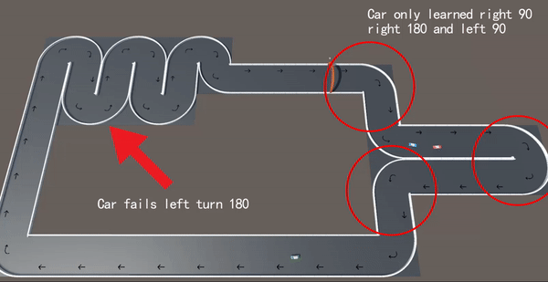
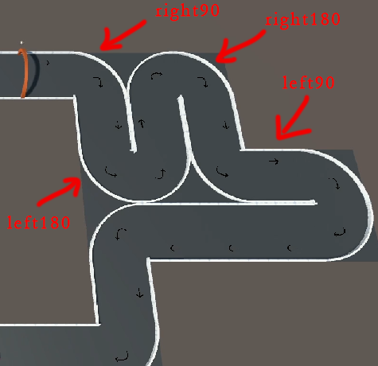
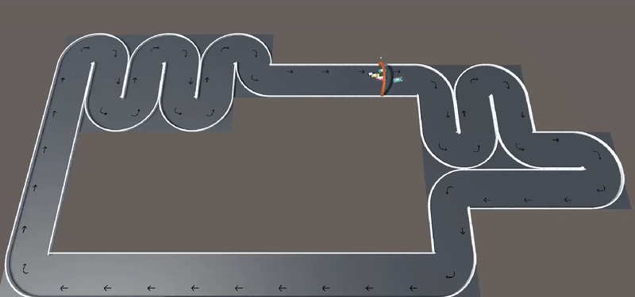
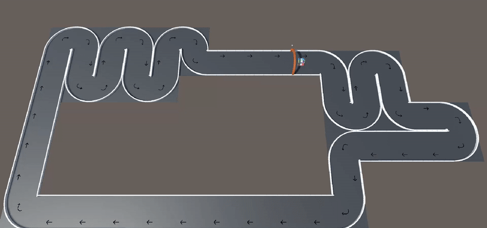
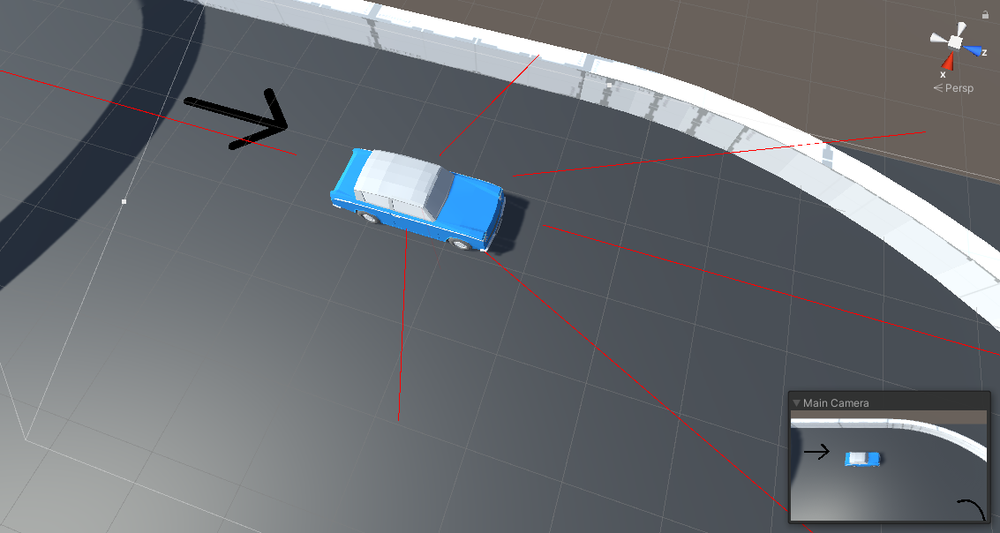

# car_RL_AI
A simple Reinforcement Learning Car AI using Proximal Policy Optimization\
Implementation using Unity ML-agent

Contents - 目次
- [Environment Setup](#popular-environment-setup)
  - [Checkpoint Method Environment](#checkpoint-method-environment)
  - [Blocks Method Environment](#blocks-method-environment)
- [Training](#training)
  - [Failure Train](#failure-train)
  - [Successful Train](#successful-train)
- [Trained Result](#trained-result)
  - [Original Race Track](#trained-result)
  - [Random Race Track](#trained-result)
- [My Car Agent Setup](#method)

## Popular Environment Setup
There are many different methods to set up the environment\
*I used Blocks Method*
### Checkpoint Method Environment
Setting a lot of checkpoint over the roads, the agent will learn how to reach the next checkpoint as fast as possible. \
Usually car will shoot rays to detect the distance between car and checkpoint plane\
**Advantages** : Easy to setup, fits any kinds of race track\
**Disadvantages** : You have to manually set up checkpoint planes for the track. It can be done automatically, however it may come some failure cases where you have to adjust by yourself. 
### Blocks Method Environment
Separate the road track by blocks, different blocks will give the agent a different desired direction. I used 3 different blocks, straight, turn left 90, turn right 90 degree.\
**Advantages** : If the car trained to be able to handle all different blocks, then theoretically any kind of race track made by the default blocks could work well.\
**Disadvantages** : You only can use the race track made by the pre-defined blocks.

## Training
### Failure Train
As you can see, the cars will always fail at the 180 degree left turn. \
The reason is, I didn't include **180 left turn** at the beginning part of the track, the agents spend too much iterations to learn how to **90 degree turns, and drive straight** \
It makes them hard to optimize to deal with a **180 degree left turn** because the neural network's weights are trained too much iternations with **90 degree turns**.\
**Solution** is making a new track,and make sure the new track includes all possible turns at beginning part of the track. So the cars could fully learn all possible turns by taking advantages of initial random sampled action. \



### Successful Train
Now the new track contains, left 90, right 90, left 180 (2x left 90), right 180 (2x right 90), and straight road at the beginning. \
Agents could quickly adapts the all possible situations and weights are optimized to handle all kinds of turns. \

```
Step: 200000.
Time Elapsed: 628.180 s. 
Mean Reward: 48.482. 
Std of Reward: 59.216.
```
x3 speed training record 



## Trained Result 
**Run the agent in different race tracks to test its performance** \
On original race track



On cycle race track


On random race track


3rd person view


## Method
### Agent
**Number of observation states** : 7 , including 6 rays check the surrounds, return the distance between car and wall, another extra state store the angle between car and desired moving direction \
**Number of actions** : 2, forward speed and turning speed \
**Reward**: take the displacement between 2 frames, if car going toward desired direction, giving a positive reward proportional to the displacement, 0 if going backward, -1 if hit wall and shut down simulation immediately. 



*Higher number of hidden units or layers will cause overfitting*

Training Parameters
```
    trainer_type: ppo
    hyperparameters:
      batch_size: 10
      buffer_size: 100
      learning_rate: 3.0e-4
      beta: 5.0e-4
      epsilon: 0.2
      lambd: 0.95
      num_epoch: 3
      learning_rate_schedule: linear
      beta_schedule: constant
      epsilon_schedule: linear
    network_settings:
      normalize: false
      hidden_units: 128
      num_layers: 2
    reward_signals:
      extrinsic:
        gamma: 0.99
        strength: 1.0
    max_steps: 500000
    time_horizon: 64
    summary_freq: 10000
```
